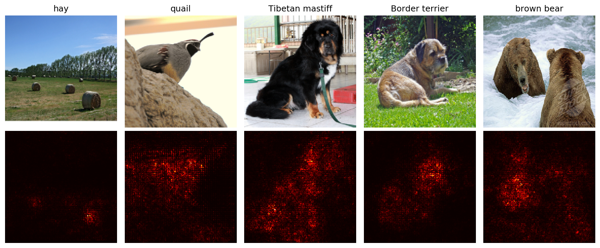

#rdfia #tme9 #cnn-visualization #imagenet #pytorch

## Visualization of Neural Networks

In this practical work, we experiment with diverse techniques with the goal to study the behavior of convolutional neural networks. 

The techniques we study are:
- Saliency maps: visualization of the importance of each pixel in the image to the classification score of the true class. ([Simonyan et al. (2014)](https://arxiv.org/abs/1312.6034))
- Adversarial examples / fooling examples: adding minor modifications to an image, imperceptible to a human, which lead to a wrong classification of the image. ([Szegedy et al. (2014)](https://arxiv.org/abs/1312.6199), [Goodfellow et al. (2015)](https://arxiv.org/abs/1412.6572))
- Class visualization (DeepDream-like): "generation" of an image corresponding to a category, in order to visualize the type of patterns detected by the network. ([Simonyan et al. (2014)](https://arxiv.org/abs/1312.6034), [Yosinski et al. (2015)](https://arxiv.org/abs/1506.06579))
  

The common principle of these approaches is to use the gradient of the input image with respect to an output class.

Therefore, the goal is not to modify/train the network but instead take a trained network, freeze its weights and backpropagates gradient of the input image, in order to study indirectly the behavior of the network.

We use the SqueezeNet network (from [Iandola et al. (2016)](https://arxiv.org/abs/1602.07360)), trained on ImageNet, designed to be very compact and eficient while allowing good results.  

### Saliency Maps

<em>Fig. 1: Images sampled from ImageNet with the saliency maps associated to their respective label.</em>

  

### Adversarial Examples

<em>Fig. 2: Images sampled from ImageNet and an adversarial example generated from each image, with target class "stingray", along with the difference between those images. For the original images, "confidence" is the probability of the image label; for the adversarial images, it is the probability of the target class.</em>

  

### Class Visualizations

<em>Fig. 6: "DeepDream-like" images generated from natural images, with target class set to the respective images labels.</em>

